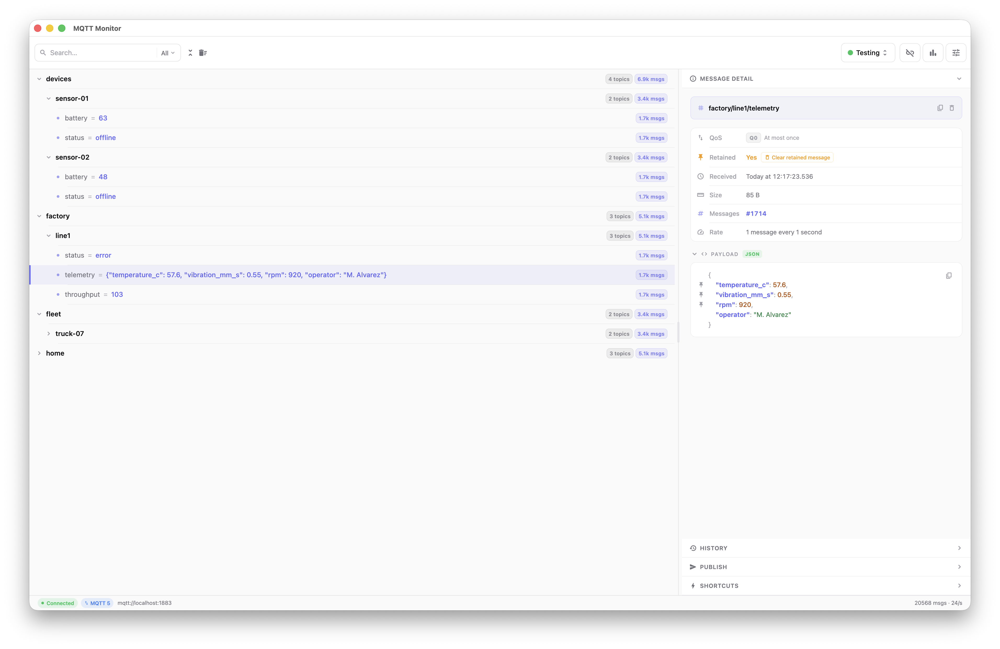
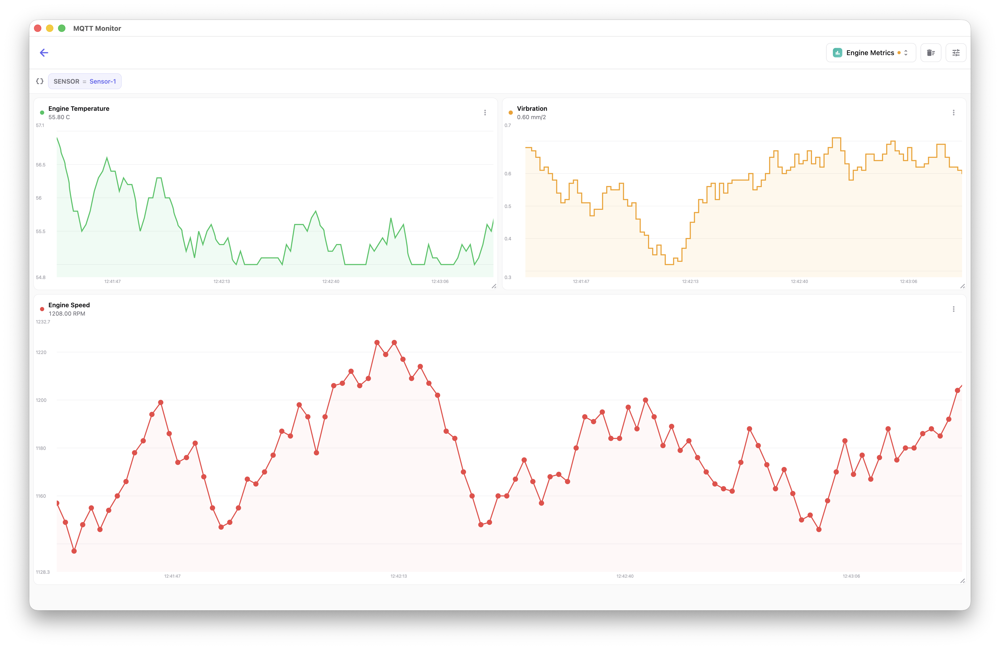
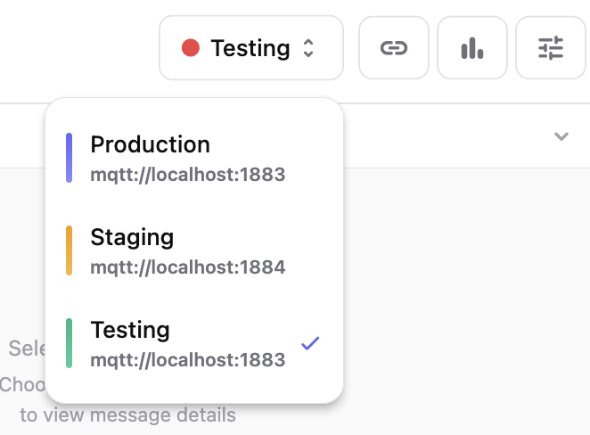
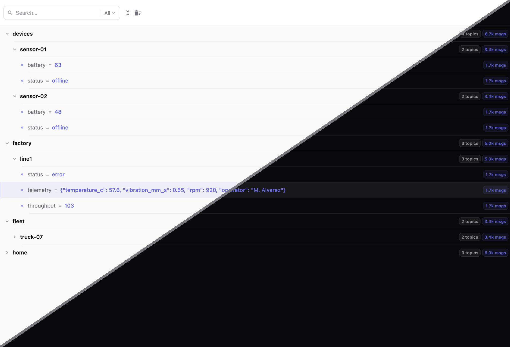
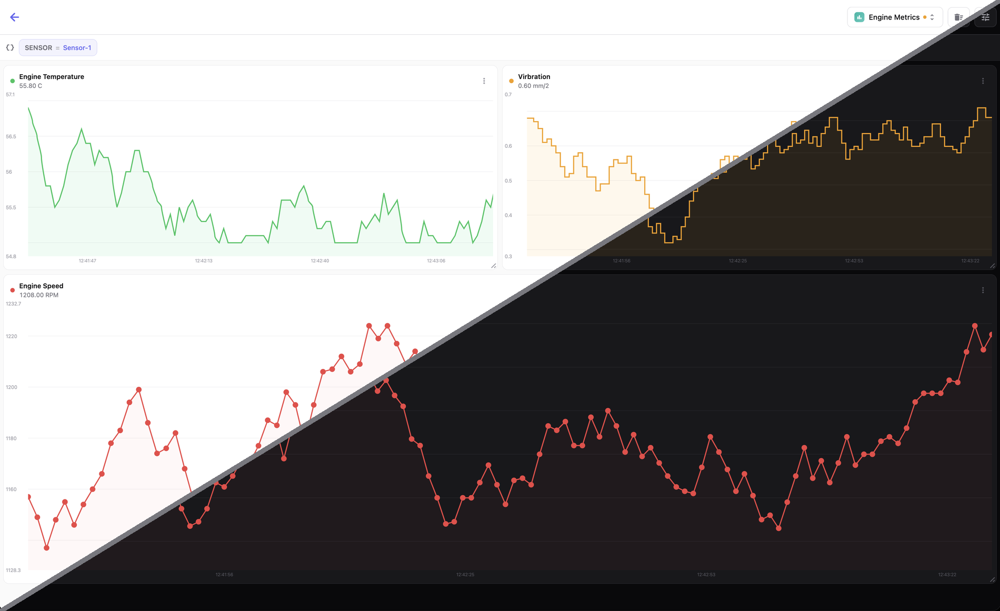
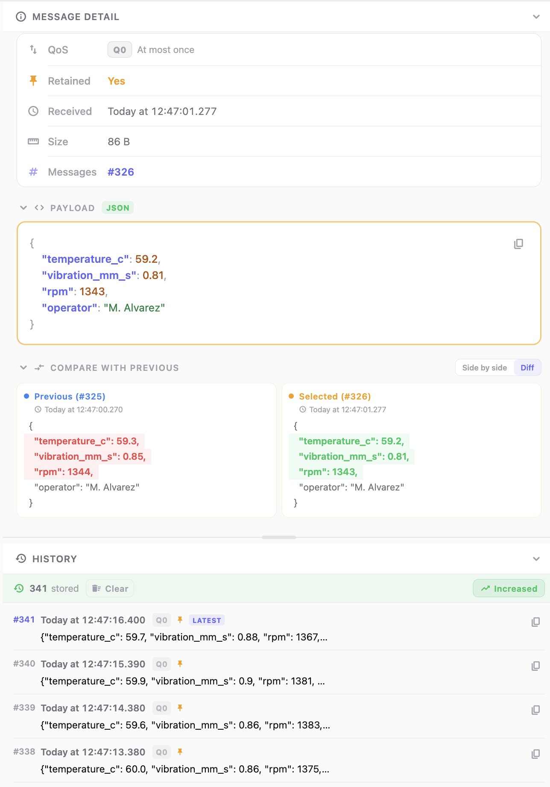
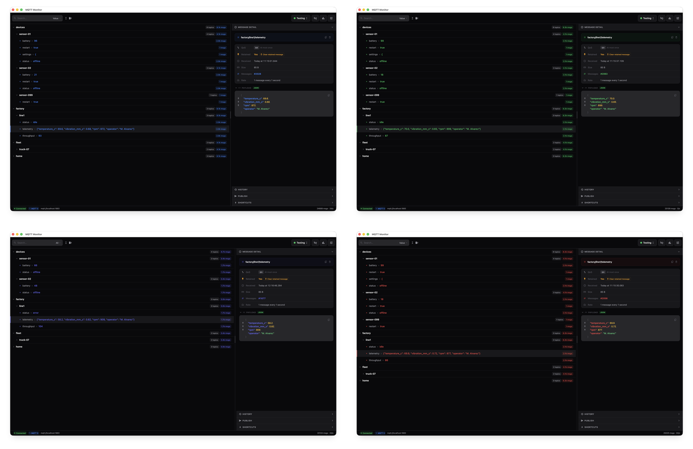

<h1 align="center">MQTT-Monitor</h1>
<p align="center">
  A fast, customizable, native desktop MQTT client for people who actually live in their broker all day.
</p>

> [!IMPORTANT]
> MQTT Monitor is currently in beta. The v1.0 release is planned for the end of August 2026.

<p align="center">
  <a href="https://ko-fi.com/micheljelsma">
    
  </a>
</p>
<p align="center">
  If MQTT-Monitor saves you time, consider <a href="https://ko-fi.com/micheljelsma">buying me a coffee on Ko-fi</a>, it genuinely helps keep this maintained.
</p>

---

Watching a fleet of devices, a home automation setup, or a busy production broker deserves something better than a log window. There are other MQTT tools out there, but I wanted one built around how I actually work, so I could see what's happening instead of decoding a raw JSON feed scrolling past. I use it every day myself, it's built around the stuff I kept running into.

It's built with Flutter and runs as a real native app on macOS, Windows, and Linux from one codebase.

**Why Flutter, and not Electron?** Flutter compiles down to native code instead of shipping a bundled browser, which makes it a lot easier to keep macOS, Windows, and Linux builds in sync from a single codebase, and it leaves the door open for a mobile app down the line.

<p align="center">
  
</p>

<p align="center">
  
</p>

---

## Contents

- [Features](#features)
- [Getting Started in VS Code](#getting-started-in-vs-code)
- [Desktop Updates](docs/updates.md)
- [Reporting Issues](#reporting-issues)
- [Credits](#credits)

---

## Features

### Broker connections, done properly

Switch between brokers in a couple of clicks, keep separate profiles for your local dev broker, staging, and production without re-entering credentials every time. Both **MQTT 3.1.1 and MQTT 5** are supported, including MQTT 5 properties like reason codes, so you're not stuck guessing why your messages don't seem to arrive.

<p align="center">
  
</p>

For anything running over TLS, certificate handling is built in rather than bolted on: point it at your **root CA, client certificate, and private key** and it just connects, no fiddling with system trust stores or extra tooling.

### A topic tree that shows you what's actually happening

The topic tree isn't just a static list, topics **flash on activity** as messages arrive, so a noisy sensor or a stuck retained message stands out immediately instead of hiding in a wall of text. It's the fastest way to get a feel for what's going on across a broker at a glance.

<p align="center">
  
</p>

Need to find something specific? The **search field filters as you type**, and you can scope it to topic names, payload values, or both, handy when you know a device sent a value but can't remember which topic it lives under.

### Turn numbers into a dashboard

Pin any numeric topic to the **dashboard** and watch it plot live as a chart instead of a scrolling number. Great for keeping an eye on temperatures, battery levels, or any value where the trend matters more than any single reading.

<p align="center">
  
</p>

### Message shortcuts, with variables

Save frequently-used publish messages as **shortcuts**, and drop **variable fields** into the payload, timestamps, incrementing counters, custom placeholders, so you're not hand-editing the same JSON every time you want to trigger something. The same variables work on the dashboard too, so a shortcut and a dashboard tile can share the same dynamic values.

### History that works the way you need it to

Every topic keeps a rolling history of past messages, and you decide how deep that history goes, the **number of retained data points is adjustable**, so you can keep things light for chatty topics and go deeper where it matters. Got a topic you're actively debugging? Flag it for **increased monitoring** and it'll store more history than the rest, without bloating memory for everything else.

When something looks off, pull up two historical messages on the same topic and **diff them side by side** to see exactly what changed between payloads.

<p align="center">
  
</p>

### Make it feel like yours

MQTT-Monitor follows your system's **light or dark theme** automatically, or you can select your own preferred mode. It goes further with a genuinely customizable UI: pick your own **accent color**, set default startup behavior, and enable **auto-connect** so your usual broker is live and streaming the moment the app opens.


<p align="center">
  
</p>

---

## Getting Started in VS Code

### Prerequisites

- [Visual Studio Code](https://code.visualstudio.com/)
- This repo cloned and opened in VS Code

### 1. Install recommended extensions

The repo ships a `.vscode/extensions.json`, so VS Code should prompt you to install the recommended extensions when you open the project, just click **Install**. If it doesn't, run **Extensions: Show Recommended Extensions** from the Command Palette (`Cmd+Shift+P` / `Ctrl+Shift+P`).

### 2. Set up Flutter & Dart

Follow Flutter's official VS Code setup guide, it walks through installing the Flutter SDK, Dart SDK, and whatever platform toolchains you need.

**[docs.flutter.dev/install/with-vs-code](https://docs.flutter.dev/install/with-vs-code)**

Once that's done, check everything's in order:

```bash
flutter doctor -v
```

### 3. Run the app in debug mode

Use the built-in VS Code task to launch a debug build on your platform. This is not a release build, it's the debug mode you'll want while actually working on the app.

Open the Command Palette (`Cmd+Shift+P` / `Ctrl+Shift+P`), run **Tasks: Run Build Task**, and pick the one for your OS:

| Platform | Task name |
|---|---|
| macOS | `Run — macOS (debug)` |
| Windows | `Run — Windows (debug)` |
| Linux | `Run — Linux (debug)` |

Or just run it from the terminal:

```bash
# macOS
flutter run -d macos

# Windows
flutter run -d windows

# Linux
flutter run -d linux
```

While it's running, the terminal stays interactive and takes single-key commands, no need to press enter:

- `r` Hot reload. 🔥🔥🔥
- `R` Hot restart.
- `v` Open Flutter DevTools.
- `w` Dump widget hierarchy to the console. (debugDumpApp)
- `t` Dump rendering tree to the console. (debugDumpRenderTree)
- `L` Dump layer tree to the console. (debugDumpLayerTree)
- `f` Dump focus tree to the console. (debugDumpFocusTree)
- `S` Dump accessibility tree in traversal order. (debugDumpSemantics)
- `U` Dump accessibility tree in inverse hit test order. (debugDumpSemantics)
- `i` Toggle widget inspector. (WidgetsApp.showWidgetInspectorOverride)
- `p` Toggle the display of construction lines. (debugPaintSizeEnabled)
- `I` Toggle oversized image inversion. (debugInvertOversizedImages)
- `o` Simulate different operating systems. (defaultTargetPlatform)
- `b` Toggle platform brightness (dark and light mode). (debugBrightnessOverride)
- `P` Toggle performance overlay. (WidgetsApp.showPerformanceOverlay)
- `a` Toggle timeline events for all widget build methods. (debugProfileWidgetBuilds)
- `g` Run source code generators.
- `h` Repeat this help message.
- `d` Detach (terminate "flutter run" but leave application running).
- `c` Clear the screen.
- `q` Quit (terminate the application on the device).

---

## Reporting Issues

MQTT-Monitor proudly doesn't track any user data. That also means there's no automatic crash or error reporting, if something goes wrong, I won't know unless you tell me.

Found a bug, or something behaving weird? [Open an issue](../../issues) and try to include:

- What you expected to happen and what actually happened
- Steps to reproduce it
- Any error messages shown, exact text or a screenshot
- For UI bugs, a screenshot or screen recording, it's usually much faster to spot what's wrong from an image than from a written description

Clear, specific issues are a lot easier for me to track down and fix, so any detail you can add helps.
